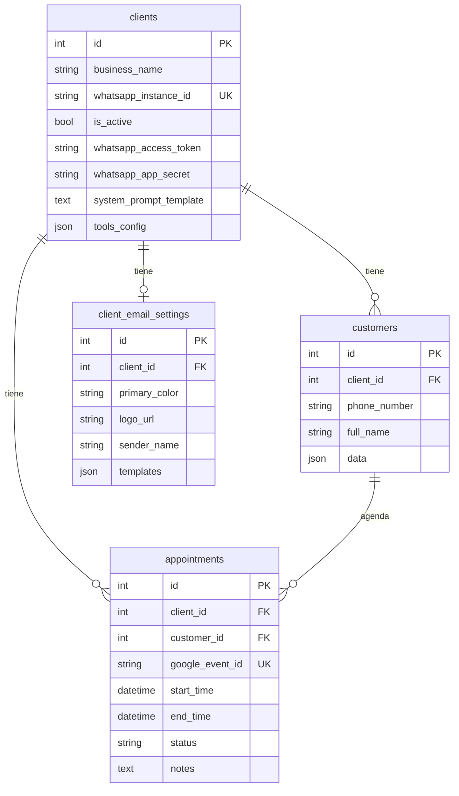

# 🤖 Panel de Admin — WhatsApp Bot SaaS

Panel administrativo para gestionar el bot de WhatsApp multi-tenant. Dos roles: **Super Admin** (tú, que administras todo) y **Cliente** (el dueño del negocio que configura su bot).

---

## 🔐 Autenticación

- Login con email + contraseña
- Roles: `super_admin` | `client`
- Reset de contraseña
- Cada cliente solo ve los datos de su propio negocio

---

## 👑 Super Admin (Tu Panel)

### 1. Dashboard Principal
- Total de clientes activos/inactivos
- Total de conversaciones del día/semana/mes
- Total de citas agendadas hoy
- Gráfica de mensajes por día (últimos 30 días)
- Clientes con más actividad

### 2. Gestión de Clientes (`clients`)
CRUD completo de clientes. Cada cliente = 1 negocio = 1 bot.

| Campo | Tipo | Descripción |
|-------|------|-------------|
| `business_name` | text | Nombre del negocio |
| `whatsapp_instance_id` | text | Phone Number ID de Meta |
| `whatsapp_access_token` | text | Token de acceso de Meta |
| `whatsapp_app_secret` | text | App Secret para verificar firmas |
| `whatsapp_api_version` | text | Versión API (default: `v21.0`) |
| `notification_email` | email | Correo a donde llegan alertas (nueva conversación, escalaciones) |
| `is_active` | toggle | Activar/desactivar bot (interruptor de pago) |
| `system_prompt_template` | textarea | Personalidad del bot (prompt base) |
| `tools_config` | JSON editor | Configuración del negocio (ver abajo) |

#### Estructura de `tools_config` (por tipo de negocio):

```jsonc
{
  // OBLIGATORIO para todos
  "business_type": "store|clinic|salon|restaurant|general",
  "timezone": "America/Santo_Domingo",
  "calendar_id": "email@gmail.com", // Google Calendar
  "business_hours": { "start": "08:00", "end": "18:00" },
  "working_days": [1,2,3,4,5], // 1=lun, 7=dom
  "currency": "$",

  // STORE (tienda con entregas)
  "delivery_available": true,
  "delivery_hours": { "start": "08:00", "end": "18:00" },
  "delivery_duration": 60, // minutos por slot
  "catalog_source": "pdf",
  "catalog_pdf_key": "client_2/catalogo.pdf", // Supabase key
  "catalog": { "categories": [{ "name": "General", "products": [{"name":"", "price":0}] }] },

  // CLINIC / SALON (profesionales con calendarios)
  "professionals": [
    {
      "id": "dr-moreira",
      "name": "Dr. Moreira",
      "specialty": "Cardiología",
      "calendar_id": "dr.moreira@gmail.com",
      "business_hours": { "start": "09:00", "end": "17:00" }
    }
  ],
  "services": [
    { "name": "Consulta General", "duration": 30, "price": 1500 }
  ],
  "requires_insurance": false,

  // RESTAURANT
  "areas": ["Terraza", "Interior", "VIP"],
  "occasions": ["Cumpleaños", "Aniversario", "Negocios"]
}
```

### 3. Configuración de Emails (`client_email_settings`)
Personalización de emails de confirmación/recordatorio por cliente.

| Campo | Tipo | Descripción |
|-------|------|-------------|
| `primary_color` | color picker | Color principal (`#333333`) |
| `secondary_color` | color picker | Color secundario (`#666666`) |
| `logo_url` | URL/upload | Logo del negocio |
| `sender_name` | text | Nombre del remitente |
| `footer_text` | text | Pie de página del email |
| `templates` | JSON | Templates personalizados (subject, intro, outro) |

### 4. Ver Todos los Clientes (Customers)
Tabla global con filtro por negocio.

| Campo | Visible | Descripción |
|-------|---------|-------------|
| `full_name` | ✅ | Nombre del cliente |
| `phone_number` | ✅ | WhatsApp |
| `data` | ✅ | JSON con datos flexibles (email, dirección, etc.) |
| `client.business_name` | ✅ | A qué negocio pertenece |
| `created_at` | ✅ | Fecha de registro |

### 5. Ver Todas las Citas (Appointments)
Tabla global con filtros por negocio, status, fecha.

| Campo | Visible | Descripción |
|-------|---------|-------------|
| `customer.full_name` | ✅ | Quién agendó |
| `start_time` / `end_time` | ✅ | Fecha y hora |
| `status` | ✅ | CONFIRMED / CANCELLED / NO_SHOW |
| `notes` | ✅ | Detalles (servicio, dirección, etc.) |
| `client.business_name` | ✅ | De qué negocio |

### 6. Monitor de Conversaciones
- Ver conversaciones activas en Redis (tiempo real)
- Ver si una conversación está manejada por IA, humano, o escalada
- Botón: **Tomar control** (pausa IA) / **Devolver a IA** (resume IA)
- Ver historial de mensajes de cualquier conversación

### 7. Logs y Monitoreo
- Tail de logs en tiempo real
- Filtrar por nivel (ERROR, WARNING, INFO)
- Alertas de errores críticos

---

## 🏪 Panel del Cliente (Lo que ve el dueño del negocio)

### 1. Dashboard
- Conversaciones del día
- Citas agendadas hoy / esta semana
- Clientes nuevos vs recurrentes

### 2. Mis Clientes (Customers)
Solo ve los suyos (filtrado por `client_id`).
- Lista con nombre, teléfono, email, datos extra
- Buscar por nombre/teléfono
- Ver historial de conversaciones de un cliente
- Exportar a CSV

### 3. Mis Citas (Appointments)
- Vista de calendario (día/semana/mes)
- Lista filtrable por status, fecha, cliente
- Cambiar status: confirmar, cancelar, marcar no-show
- Ver detalles (notas, servicio, dirección)

### 4. Configuración del Bot
**El cliente puede editar (con UI amigable, NO JSON directo):**

| Sección | Campos editables |
|---------|-----------------|
| **Horarios** | Hora inicio/fin, días laborables |
| **Personalidad** | Textarea del prompt (con guía/tips) |
| **Catálogo** | Subir PDF o editar productos manualmente |
| **Servicios** | Agregar/editar/eliminar servicios con precio y duración |
| **Profesionales** | Nombre, especialidad, calendario, horarios individuales |
| **Entregas** (store) | Activar/desactivar, horarios, duración de slots |
| **Áreas** (restaurant) | Lista de áreas del restaurante |

### 5. Configuración de Emails
- Subir logo
- Elegir colores (color picker)
- Personalizar nombre del remitente
- Preview del email en tiempo real

### 6. Conversaciones en Vivo
- Ver conversaciones activas
- Tomar control de una conversación (pausa IA)
- Responder directamente desde el panel
- Devolver a IA cuando termine

---

## 📊 Tablas de la Base de Datos



---

## 🔌 Endpoints API Necesarios

### Auth
| Method | Endpoint | Descripción |
|--------|----------|-------------|
| POST | `/auth/login` | Login |
| POST | `/auth/forgot-password` | Reset de contraseña |

### Clients (Super Admin)
| Method | Endpoint | Descripción |
|--------|----------|-------------|
| GET | `/api/clients` | Listar todos |
| GET | `/api/clients/:id` | Detalle |
| POST | `/api/clients` | Crear |
| PUT | `/api/clients/:id` | Actualizar |
| PATCH | `/api/clients/:id/toggle` | Activar/desactivar |
| DELETE | `/api/clients/:id` | Eliminar |

### Customers
| Method | Endpoint | Descripción |
|--------|----------|-------------|
| GET | `/api/customers?client_id=X` | Listar (filtrar por negocio) |
| GET | `/api/customers/:id` | Detalle con data JSON |
| PUT | `/api/customers/:id` | Actualizar datos |
| GET | `/api/customers/:id/history` | Historial de chat (Redis) |
| GET | `/api/customers/export?client_id=X` | Exportar CSV |

### Appointments
| Method | Endpoint | Descripción |
|--------|----------|-------------|
| GET | `/api/appointments?client_id=X&date=Y` | Listar con filtros |
| PATCH | `/api/appointments/:id/status` | Cambiar status |
| GET | `/api/appointments/calendar?client_id=X` | Vista calendario |

### Conversations (Real-time)
| Method | Endpoint | Descripción |
|--------|----------|-------------|
| GET | `/api/conversations?client_id=X` | Conversaciones activas |
| POST | `/api/conversations/:phone/takeover` | Tomar control (pausa IA) |
| POST | `/api/conversations/:phone/release` | Devolver a IA |
| POST | `/api/conversations/:phone/send` | Enviar mensaje desde panel |
| GET | `/api/conversations/:phone/messages` | Ver historial |

### Email Settings
| Method | Endpoint | Descripción |
|--------|----------|-------------|
| GET | `/api/email-settings/:client_id` | Ver configuración |
| PUT | `/api/email-settings/:client_id` | Actualizar |
| POST | `/api/email-settings/:client_id/preview` | Preview del email |

### Config (Edición amigable de tools_config)
| Method | Endpoint | Descripción |
|--------|----------|-------------|
| GET | `/api/config/:client_id/hours` | Horarios |
| PUT | `/api/config/:client_id/hours` | Actualizar horarios |
| GET | `/api/config/:client_id/services` | Servicios |
| PUT | `/api/config/:client_id/services` | Actualizar servicios |
| GET | `/api/config/:client_id/professionals` | Profesionales |
| PUT | `/api/config/:client_id/professionals` | Actualizar profesionales |
| POST | `/api/config/:client_id/catalog/upload` | Subir PDF catálogo |

---

## ⚠️ Consideraciones Importantes

1. **Nunca exponer `tools_config` como JSON editable al cliente** — siempre usar formularios amigables que construyan el JSON internamente
2. **Sanitizar inputs** — el backend ya sanitiza HTML, pero validar también en el frontend
3. **Todos los clientes DEBEN tener `whatsapp_app_secret`** configurado para producción
4. **El campo `data` en Customers es JSON flexible** — mostrar como key-value pairs editables
5. **Conversaciones en Redis expiran** — guardar historial importante en la BD si es necesario
6. **Google Calendar** — cada cliente necesita compartir su calendario con la service account del bot
